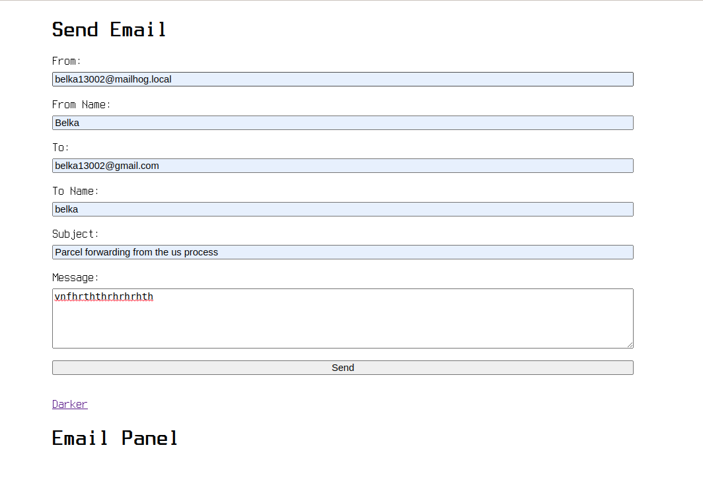

##### ...by zshmeta

 

##  Own your webmail (part of it)

#### What is this?

This is an outline of what it takes to have mailhog catch and send emails directly from our local host

#### Why is this?

Although it exists about a million tool for every half task in the developer's workflow, it is always good to get familiar with extra tools

#### How is this

The tools that were used are Docker, ChatGPT, PHPStorm PHP html and css. Mailhog will run in a docker container and an smtp and web mail interface which will hook to our project using PHP Mailerwill be hooked to itwith using phpMailer

#### What is the result?

Well not really launching rockets here but here was the hardest part: after mapping uusers input into variables we had to determine the right syntax for the synchronisation between User submitting, PHP Mailer handling the intake and output and mailhog serving the mail to the internrt, and Mailhog.